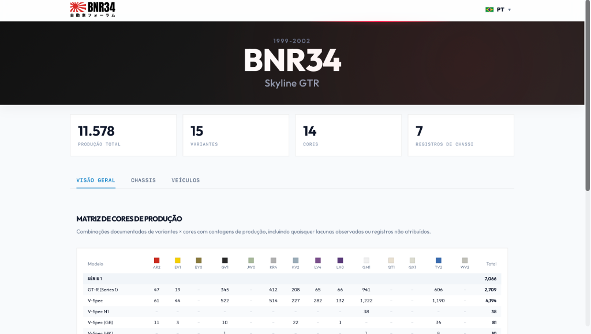

<div align="center">
  <a href="https://thelustosa.github.io/forum-automotivo/">
    
  </a>

  <br><br>

  <h1>Fórum Automotivo BNR34</h1>
  
  <p>
    Uma aplicação web interativa desenvolvida em React para apresentar documentação histórica e estatísticas de produção do lendário Nissan Skyline GT-R BNR34.
  </p>

  <p>
    <a href="https://thelustosa.github.io/forum-automotivo/" target="_blank">
      
    </a>
  </p>

  <p>
    
    
    
  </p>
</div>

---

O painel fornece dados sobre combinações de variantes e cores de fábrica, contagens totais e registros de chassi, servindo como uma biblioteca visual e informativa para entusiastas.

## Funcionalidades Principais

- **Matriz de Cores e Produção:** Tabelas interativas mostrando o número de unidades fabricadas, divididas por Série 1, Série 2 e suas respectivas cores de catálogo.
- **Visualizador de Veículos:** Sistema que exibe vetores de alta resolução (SVG) do carro, alternando entre as cores icônicas da montadora.
- **Internacionalização:** Menu de seleção de idiomas com suporte para Português, Inglês, Espanhol e Japonês.
- **Interface Dinâmica:** O layout e os cards de interação reagem suavemente, mantendo a responsividade em diversos tamanhos de tela.

## Tecnologias Base

- React.js
- Vite
- CSS3 Nativo

## Como Rodar Localmente

Para rodar ou modificar o projeto em seu ambiente local, siga os passos abaixo:

1. Acesse o diretório do projeto e instale as dependências:
   ```bash
   npm install
   ```

2. Execute o servidor de desenvolvimento:
   ```bash
   npm run dev
   ```

3. Para gerar a versão final otimizada para produção:
   ```bash
   npm run build
   ```

## Deploy Automático (GitHub Pages)

O repositório já está configurado com um workflow do GitHub Actions.

